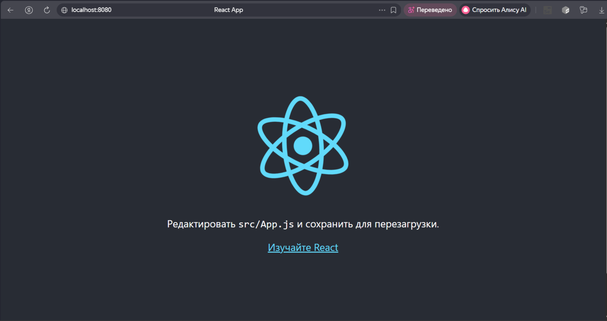

# Docker Lab 3 — React + Nginx multi-stage build

## Описание

Простое React-приложение, собранное в Docker-образ с использованием многоступенчатой сборки. Финальный образ содержит Nginx и собранную статику.

## Скриншот работающего приложения



## Инструкция по сборке и запуску

### 1. Сборка Docker-образа

```bash
docker build -t lab3-app .